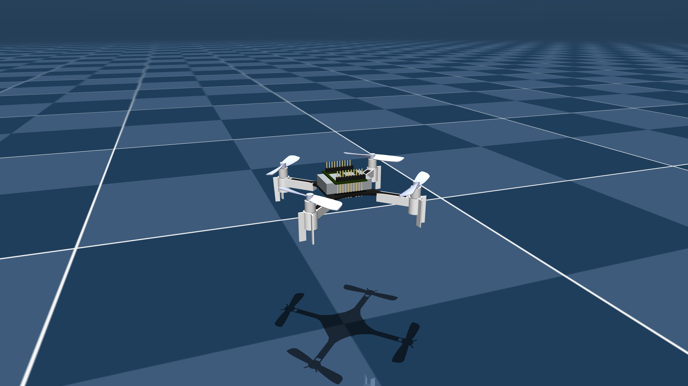

# Multi-Drone Simulation - MuJoCo

Requires **MuJoCo 2.2.2** or later.

## Overview

The files consist of simulations of drones in MuJoCo environments.  
This package includes a simplified robot description (MJCF) of the Crazyflie 2 model from [Bitcraze](https://www.bitcraze.io/). It is derived from the publicly available [ROS description](https://github.com/whoenig/crazyflie_ros).


<p align="center">
  
  
</p>
<p align="center">
  
  
</p>


## Installation

The required packages are included in the Conda environment file. Use this command to create a Conda environment in your system:

```bash
conda env create -f environment.yml 
```

### Package Descriptions

- **1_drones folder**:  
  - This folder contains a MuJoCo environment featuring a closed-loop PID controller that maintains a drone at a specified height.
  - You can modify the **PID values** and **goal positions** directly in the `simulate1_v1.py` file.
  - The `simulate1_v1.py` file allows the drone to move in the X, Y, and Z directions by defining the goal position in 3D space.
  - In contrast, the `simulate1_v2.py` file focuses solely on the Z-axis, enabling the drone to lift and maintain its position at the desired height while keeping its X and Y coordinates constant.

- **2_drones folder**:  
  - This folder contains the `simulate2.py` file, which simulates two drones positioned at either end of a slab, with a spherical object balanced in the center.
  - This setup is designed to mimic a cooperative multi-drone transport system.
  - Both drones receive a minimal fly-off thrust, which allows them to lift the slab while keeping the ball balanced in the middle.

- **3_drones folder**:  
  - This folder includes the `simulate3.py` file, which extends the cooperative transport simulation by utilizing three drones instead of two.
  - The setup mirrors the structure found in the `2_drones` folder, adapting it for an additional drone to enhance collaborative transport capabilities.

- **4_drones folder**:  
  - This folder features the `simulate4.py` file, showcasing the cooperative transport simulation with four drones.
  - The setup builds upon the previous configurations, demonstrating how four drones can work together to achieve balanced transport of the slab and the spherical object.
